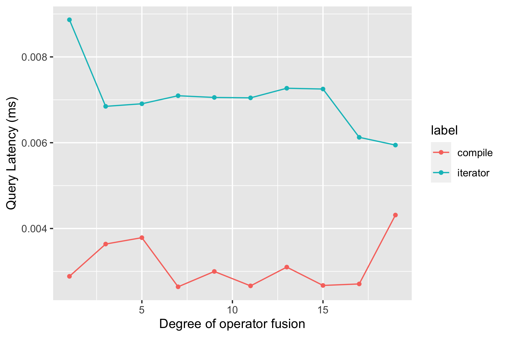

## A4: Benchmarking

* Released:  10/20
* Due: 11/6 11:59PM EST
* Teams of 1 or 2

You will now devise experiments to understand when and why compilation helps improve DataBass' performance
as compared to the iteration-based approach.  We will first walk you through an experiment, and then ask you 
to design your own experiment for your class project.


[General tips for organizing, running, and plotting experiments](https://github.com/researchsetup/researchsetup.github.io/wiki/code#running-experiments).


### Background

Experiments are designed based on the specific hypotheses that one wishes to test.
Typically, in systems, the hypothesis is that a specific system design factor was the cause of differences in performance from some baseline(s).
The way to test this is to craft queries and datasets that are expected to show this performance difference
_and_ queries and datasets that are expected to not show the performance difference.  The ability to distinguish 
when a design decision works and when it does not work is the hallmark of careful experimental design.

As an aside, the other major type of experiment is when a system is complex.  In this case, you may see evidence of performance differences, but don't know what design decisions are the true reasons, and thus it is difficult to formulate a clear hypothesis.  Profiling experiments are valuable here, where you measure different components of a system and run ablation studies that toggle different design decisions to measure their effects.   The [OLTP Through the Looking Glass](https://w6113.github.io/files/papers/oltpperf-sigmod08.pdf) is a good example of such an experiment.

### Task 0: Clone The Writeup Document

* [Go to the overleaf project](https://www.overleaf.com/read/cfqfrtvhkypx)
* Clone it
* Add you and your partner's infos
* You will answer the questions and submit the writeup PDF in the Google Form 

### Task 1: Hypothesis One

The Neumann paper mentioned that operator fusion is key to reducing cache invalidations, and ultimately will improve performance.  We generate a plot where the x-axis is "degree of operator fusion", and the y-axis is query latency.  If the hypothesis is true, the gap between compilation- and iterator-based execution should grow; if false, it should not change.  You code will be in [benchmark.py](../benchmark.py).

What is a good way to quantify the degree of operator fusion?  The property we want is for the iterator-based execution to grow in number of operators, whereas the compiled code to remain a tight loop.  One way is to vary the number of predicates in the query.  

**Our hypothesis is thus: increasing the number of predicates in a query will increase the cost of an iterator-based executor at a larger rate than the cost of a cost-based executor.**

The starter code in [benchmark.py](../benchmark.py) generates a query workload that varies the number of predicates.  It uses the [pygg](https://github.com/sirrice/pygg) library to plot the results.  You may need to follow its installation instructions to run the benchmark, or feel free to change the plotting function to use your favorite plotting library. Now run the benchmark:

```bash
python benchmark.py
```

It should generate a figure `fusion_workload_1.png` and then crash when it tries to run workload 2.  The figure should look like this:



**Task 1.1:** Study this figure, there's something suspicious about it. It turns out the reported performance is not _solely_ due to the degree of operator fusion, and is actually due to another factor.  Describe what trend the iterator line should exhibit, and why it does not exhibit it.  

**Task 1.2**: Based on your answer to task 1.1, fill in `fusion_workload_2` to generate a workload that fixes the issue.  Once you do so, the code should generate the figure `fusion_workload_2.png`.  

**Task 1.3:** Add the figure to your writeup and write a few sentences about what the figure shows and why the lines behave the way they do.  Since the query we used is very simple, comment on whether or not you believe this finding generalizes to more complex queries (provide concrete examples for your argument).


### Task 2: Hypothesis Two

Operator fusion is not the only case where compilation exhibits benefits.   

**Task 2.1:** Describe another hypothesis for the type of queries that compilation is well suited for. 

**Task 2.2:** Fill in `custom_workload()` in the benchmark to generate such a workload.  Once you do so, the code should generate the figure `custom_workload.png`.    Add the figure to your writeup.

**Task 2.3:** Write a few sentences about what the figure shows, and why the lines behave the way they do.  Comment on the extent that your finding generalizes.

### Task 3: Applying Hypothesis-driven Experiment Design

Outline two hypotheses for your class project and describe the experimental design.  At minimum, each hypothesis should include:

* justification for why the hypothesis is appropriate,
* baselines,
* workloads,
* description of the datasets, or specific datasets if identified (if applicable),
* the appropriate metrics,
* the parameters to vary,
* and what the generated plot is expected to look like (including what its axes should be).  

Rationale for why each decision is appropriate should be included.

## Submission

1. Make sure your solution has been pushed to the appropriate branch
2. Make sure the staff have been added as collaborators to the repo
3. Fill out [this google form](https://forms.gle/5TB6pXbg7hnyUaWd8)
